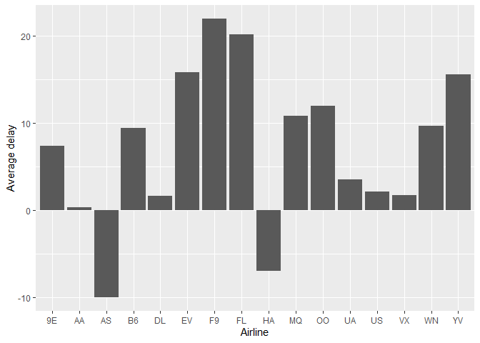

README
================
Bo Li
2022/10/12

#### Question:

What time of day should you fly if you want to avoid delays as much as
possible? Does this choice depend on anything? Season? Weather? Airport?
Airline? Find three patterns (“null results” are ok!). Write your
results into Rmarkdown. Include a short introduction that summarizes the
three results. Then, have a section for each finding. Support each
finding with data summaries and visualizations. Include your code when
necessary. This shouldn’t be long, but it might take some time to find
the things you want to talk about and lay them out in an orderly way.

#### time by hour

``` r
avgdelay = flights %>%
  group_by(hour) %>%
  summarise(arr_delay = mean(arr_delay, na.rm = TRUE)) %>%
  arrange(arr_delay) 
ggplot(data = avgdelay, aes(x= hour, y = arr_delay)) + 
  geom_bar(stat="identity") + 
  ylab('Average delay') +
  xlab('Hour')
```

    ## Warning: Removed 1 rows containing missing values (position_stack).

<!-- -->

The delay happends more on evening and low on morning. So people should
take flights before 10am if they want to avoid delays as much as
possible.

#### Destination Airport

``` r
delay_airport= flights %>%
  group_by(dest) %>%
  summarise(n = n(), arr_delay = mean(arr_delay, na.rm = TRUE)) %>%
  arrange(arr_delay) 
ggplot(data = delay_airport, aes(x= dest, y = arr_delay)) + 
  geom_bar(stat="identity") + 
  ylab('Average delay') +
  xlab('Destination Airport') +
  theme_grey(base_size = 8) +
  theme(axis.text.x = element_text(angle = -90))
```

    ## Warning: Removed 1 rows containing missing values (position_stack).

<!-- --> From the
graph, we can see ANC, LGA, PSP, SRO, and SYB have significant negative
average delay time which recommenced as destination.

#### Airline

``` r
delay_carrier= flights %>%
  group_by(carrier) %>%
  summarise(n = n(), arr_delay = mean(arr_delay, na.rm = TRUE)) %>%
  arrange(arr_delay) 
ggplot(data = delay_carrier, aes(x= carrier, y = arr_delay)) + 
  geom_bar(stat="identity") + 
  ylab('Average delay') +
  xlab('Airline')
```

<!-- -->

The graph demonstrate AS and HA with negative average delay, so
recommend to take those carrier and avoid EV, F9, YV, and Fl.

#### Summary

To avoid the delay of flights,take flight in the morning to LGA or PSP
with Alaska Airlines or Hawaiian Airlines.
